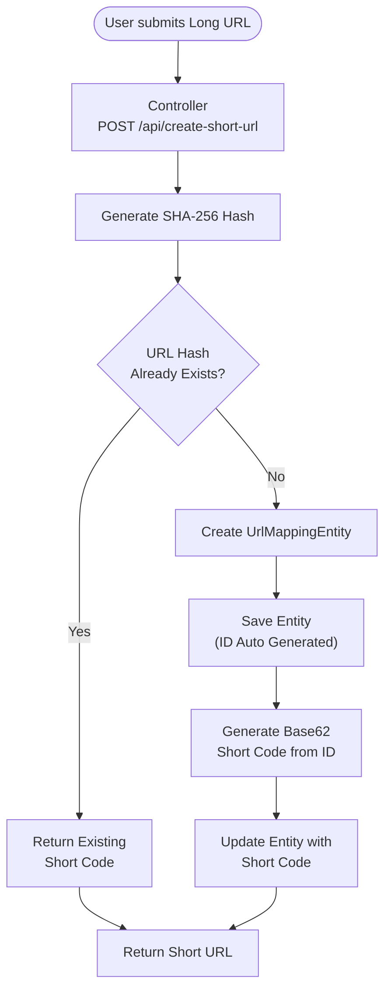

# URL SHORTENER APP
Takes the long user URL and return shortened url 
## Architecture Diagram

```mermaid
---
config:
  theme: mc
  layout: fixed
---
flowchart TB

    Start([User submits Long URL])

    Controller["Controller<br/>POST /api/create-short-url"]

    Hash["Generate SHA-256 Hash"]

    Check{"URL Hash<br/>Already Exists?"}

    Existing["Return Existing<br/>Short Code"]

    Create["Create UrlMappingEntity"]

    Save["Save Entity<br/>(ID Auto Generated)"]

    Encode["Generate Base62<br/>Short Code from ID"]

    Update["Update Entity with<br/>Short Code"]

    Response["Return Short URL"]

    Start --> Controller
    Controller --> Hash
    Hash --> Check

    Check -- Yes --> Existing
    Existing --> Response

    Check -- No --> Create
    Create --> Save
    Save --> Encode
    Encode --> Update
    Update --> Response
```