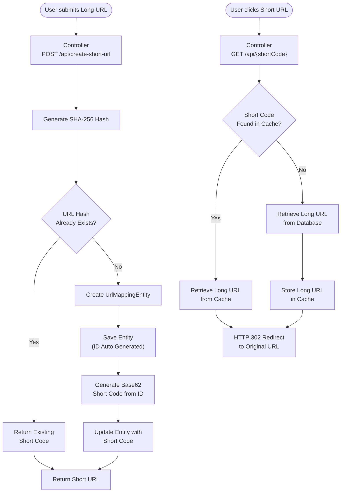

# URL SHORTENER APP
- Takes the long user URL and return shortened url 
- Used Redis cache to speed up the frequently accessed url
- Long url is hashed and stored to database
- Short code generated usn base62 encoder
## Architecture Diagram
